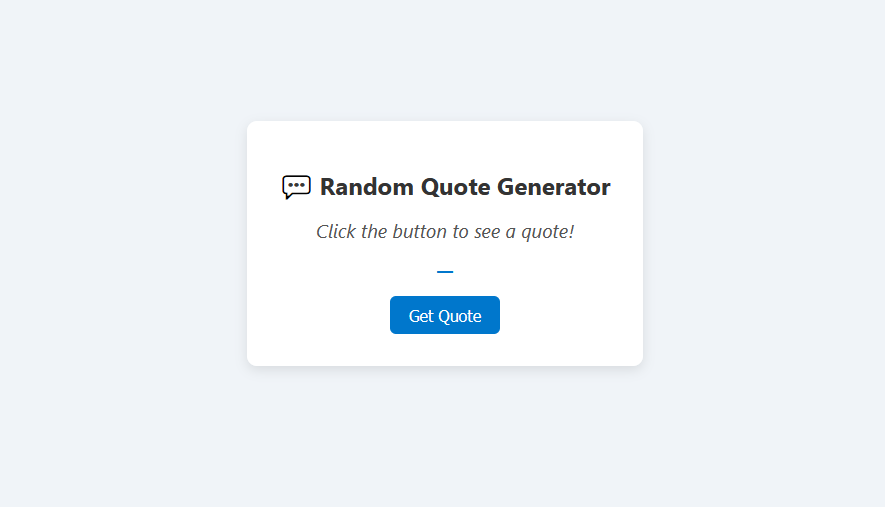

# 💬 Random Quote Generator

A clean and simple Random Quote Generator built using HTML, CSS, and vanilla JavaScript. Click a button to display an inspirational quote from a predefined collection—perfect for daily motivation or as a mini front-end project!

---

## 📸 Demo

N

---

## ✨ Features

- 🧠 Displays a new quote on button click  
- 💾 Quotes are stored locally in a JavaScript array  
- 📱 Responsive and mobile-friendly design  
- 🎨 Smooth UI interactions  
- ✅ No external libraries or APIs needed

---

## 🛠 Technologies Used

- HTML5  
- CSS3 (Flexbox, custom styling)  
- JavaScript (ES6+)

---

## 📂 File Structure

- **index.html**  # Main layout
- **style.css**  # Styling
- **script.js**  # Strength evaluation logic

---

## 📝 How to Use

1. **Open the HTML file in your browser:**  
   Navigate to the `index.html` file and open it in your preferred web browser to see the quote generator in action.
2. **Click the "New Quote" button:**  
   Once the page loads, click the "New Quote" button to display a new inspirational quote.
3. **Enjoy your motivational quote!**  
   The quote generator will display a new quote each time you click the button.

---

## 📥 Installation

1. Clone the repository:

   ```bash
   git clone https://github.com/your-username/quote-generator.git
   cd quote-generator
